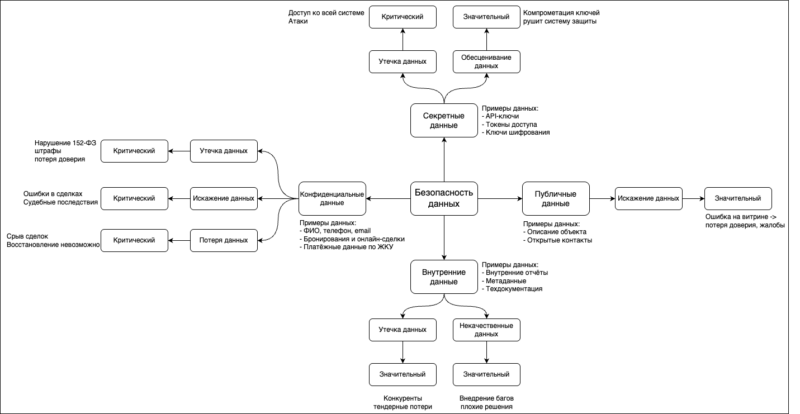

# Задание 1 - Проверочный лист по безопасности данных

## 1. Классификация данных PropDevelopment

Классификация проведена в соответствии со стандартами ISO/IEC 27001 и 27002.

### Публичные данные

Данные, которые не требуют защиты и могут быть открыто опубликованы:

- Описание объектов недвижимости (витрина).
- Общая информация о компании.
- Контактные данные отдела продаж.

### Внутренние данные

Доступны только сотрудникам компании, не содержат персональных данных:

- Внутренние отчёты и метрики.
- Техническая документация.
- Логи действий пользователей.

### Конфиденциальные данные

Содержат персональные и чувствительные данные клиентов:

- ФИО, телефон, email.
- Анкеты для онлайн-сделки.
- Информация о бронированиях и сделках.
- Платёжная информация по ЖКУ.

### Секретные данные

Доступ строго ограничен. Компрометация может нарушить безопасность всей системы:

- API-ключи к госорганам.
- Токены доступа.
- Ключи шифрования.
- Административные учётные записи.

---

## 2. Риски по категориям

Для каждой категории данных определены ключевые риски, присвоена их критичность и даны обоснования.

| Категория            | Тип риска             | Оценка       | Обоснование                                                                             |
|----------------------|-----------------------|--------------|-----------------------------------------------------------------------------------------|
| **Публичные**        | Искажение данных      | Значительный | Искажение информации на витрине может вызвать путаницу у клиентов и навредить репутации |
| **Внутренние**       | Утечка данных         | Значительный | Конкуренты могут получить стратегическую информацию                                     |
| **Внутренние**       | Некачественные данные | Значительный | Ошибки в техдокументации могут привести к багам и уязвимостям                           |
| **Конфиденциальные** | Утечка данных         | Критический  | Утечка ПДн — штрафы, потеря доверия, нарушение закона (152-ФЗ)                          |
| **Конфиденциальные** | Искажение данных      | Критический  | Модификация данных может повлиять на юридическую корректность сделок                    |
| **Конфиденциальные** | Потеря данных         | Критический  | Без резервного копирования сделки могут быть сорваны                                    |
| **Секретные**        | Утечка данных         | Критический  | Компрометация ключей и токенов — угроза всей системе                                    |
| **Секретные**        | Обесценивание данных  | Значительный | Компрометация ключей делает остальную защиту бессмысленной                              |

---

## 3. Визуализация

Файл `mindmap.drawio` содержит визуализацию в формате mindmap с классификацией, рисками и их оценкой.  
Также приложен экспорт в виде PNG для предварительного просмотра.

